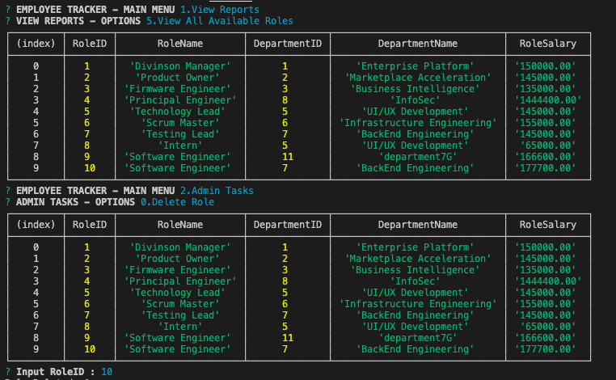
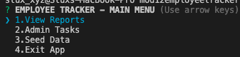
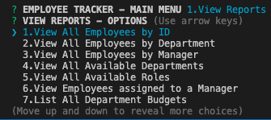
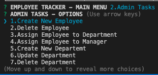
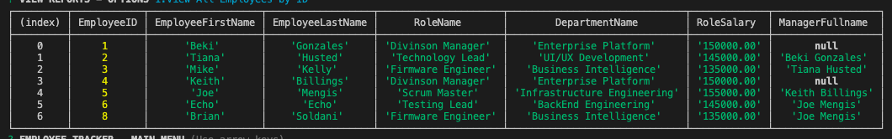

# 12 MySQL: Employee Tracker

   

## Description

Node CLI application that interfaces with a MySQL DB in order to facilitate management employees of an organization.

## Snapshot



## TableOfContents

* [Description](#Description)
* [Snapshot](#Snapshot)
* [TableOfContents](#TableOfContents)
* [UserStory](#UserStory)
* [AcceptanceChecklist](#AcceptanceChecklist)
   * [InitialRequirements](#InitialRequirements)
   * [ApplicationRequirements](#ApplicationRequirements)
   * [BonusRequirements](#BonusRequirements)
   * [SubmissionRequirements](#SubmissionRequirements)
* [AppUsage](#AppUsage)
   * [Installation](#Installation)
   * [Configuration](#Configuration)
   * [Operation](#Operation)
   * [Output](#Output)
* [Features](#Features)
* [VideoWalkthrough](#VideoWalkthrough)

## UserStory

As A business owner

I WANT to be able to view and manage the departments, roles, and employees in my company

SO THAT I can organize and plan my business

## AcceptanceChecklist

### InitialRequirements

Design the following database schema containing three tables:

* **department**:

 * **id** - INT PRIMARY KEY
 * **name** - VARCHAR(30) to hold department name
 * **department_created** - was added in order to keep track of creation - Issac.

* **role**:

 * **id** - INT PRIMARY KEY.
 * **title** -  VARCHAR(30) to hold role title.
 * **salary** -  DECIMAL to hold role salary.
 * **department_id** -  INT to hold reference to department role belongs to
 * **role_created** - was added in order to keep track of creation - Issac.

* **employee**:

 * **id** - INT PRIMARY KEY.
 * **first_name** - VARCHAR(30) to hold employee first name.
 * **last_name** - VARCHAR(30) to hold employee last name.
 * **role_id** - INT to hold reference to role employee has.
 * **manager_id** - INT to hold reference to another employee that manager of the current employee. This field may be null if the employee has no manager.
 * **employee_created** - was added in order to keep track of creation - Issac.

Implement table relationships like specified in the diagram below:


- For full DB schema implementation details please proceed to review `scheema.sql` file [link]('./scheema.sql').

### ApplicationRequirements

* Add departments, roles, employees.
    - Done. Issac.

* View departments, roles, employees.

   - Done. Issac.

* Update employee roles.

   - Done. Issac.

### BonusRequirements

* Update employee managers

   - Done. Issac.

* View employees by manager

   - Done. Issac.

* Delete departments, roles, and employees

   - Done. Issac.

* View the total utilized budget of a department -- ie the combined salaries of all employees in that department

   - Done. Issac.

### SubmissionRequirements

* Use the [MySQL](https://www.npmjs.com/package/mysql) NPM package to connect to your MySQL database and perform queries.

- [MySQL2](https://www.npmjs.com/package/mysql2) NPM package was used instead, since the original package mentioned doesn't support `async/await` notation.

* Use [InquirerJs](https://www.npmjs.com/package/inquirer/v/0.2.3) NPM package to interact with the user via the command-line.

   - Done. Issac.

* Use [console.table](https://www.npmjs.com/package/console.table) to print MySQL rows to the console. There is a built-in version of `console.table`, but the NPM package formats the data a little better for our purposes.

   - Done. Issac.

* You will need to perform a variety of SQL JOINS to complete this assignment.

   - Done. Details are provided in the `scheema.sql` file. Issac

* You may wish to include a `seed.sql` file to pre-populate your database. This will make development of individual features much easier.

   - Done. Details are provided in `seed.sql` file. After building the schema in Workbench, option #3 in the main menu was provided in order to run the seed file. Issac

* Separate file containing functions for performing specific SQL queries you'll need to use.

   - Directory structure used was the following:

```
assets/ .................... README Images.
   scheema.jpg
   snapshot.jpg
mysql/ ..................... MySQL Details.
   connection.js .......... connection pool creation in order to interface with DB.
   initial.js ............. Insert methods for initial seed data load.
   seed.js ................ Data to be inserted during initial seeding load.

orm/ ....................... CRUD operations for Tables and views in DB.
   budgetview.js .......... View implemented in order to display budget summaries.
   department.js .......... CRUD operations for the Department table.
   departmentview.js ...... View designed to display Role-Department relationships.
   employee.js ............ CRUD operations for Employee table.
   employeeview.js ........ Employee view to display all data linked.
   managerview.js ......... Displays employees listed as managers.
   role.js ................ CRUD operations for Role table.

app.js ..................... Runs the application and captures input using inquirer.
scheema.sql ................ Runs the application and captures input using inquirer.
seed.sql ................... Lists seeds data.

```
## AppUsage

### Installation

*Step 1.* Clone repo into your localhost.

*Step 2.* Open Terminal and run "npm i" in order to install dependencies.

### Configuration

*Step 1.* Go to [connection.js]('./mysql/connection.js') and update with your DB password.

*Step 2.* Open SQL Workbench and run `scheema.sql`.

*Step 3.* type `node index.js` in your terminal.

*Step 4.* Select option `3.Seed Data` in your terminal in order to load seed data.

### Operation

*Step 1.* Go to Terminal and type `node index.js`, the following menu will appear.



*Step 2.* Go to `1.View Reports` option if you want to see all the available reports.



*Step 3.* Select `2.Admin Tasks` in order to create, update or delete employees, managers and departments.



*Step 4.* Choose `3.Seed Data` in order to load initial data (schema has to be preloaded beforehand). 

*Step 5.* Select `4.Exit App` if you want to quit.

### Output

* All output is provided in terminal console.



## Features

* In order to be able to use async notation, MySQL2 library was required and connection pool logic was needed to be implemented.

* All database interface methods are invoqued using async/await notation.

* Database invocations all connect, fetch data and detroy the connection afterwards.

* Database Views were implemented in order to decouple data presentation functionality from our CLI app.

## PendingItems

* `index.js` should be broken into 3 or 4 files. Due to time constraints a lot of functionality wounded up being implemented in that single location.

## VideoWalkthrough

The following links provide video walkthroughs explaining the development decisions made for this project and a walkthrough of the usage of the app. 

* [Video Demo](https://youtu.be/7Xet7EA5HDY)